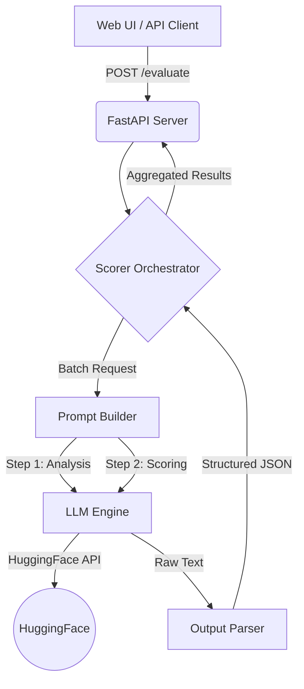

# Conversation Evaluation Benchmark System

A scalable, production-ready system for evaluating LLM conversations across 300+ facets of quality, safety, and psychology.


## Features

- **Multi-Faceted Scoring**: Evaluates conversations on 391 distinct facets (e.g., Empathy, Risk, Logic, Bias).
- **HuggingFace Backend**: Real semantic scoring using open-weight models (Qwen, Llama, Mixtral).
- **Visual Dashboard**: Glassmorphism UI with radar charts, score breakdowns, and JSON export.
- **Scalable Architecture**: Async Python backend (FastAPI) handling batched processing for thousands of facets.
- **Docker Ready**: Full containerization for easy deployment.

## Quick Start

### 1. Install Dependencies
```bash
pip install -r requirements.txt
```

### 2. Configure Environment
Rename `.env.example` to `.env` and set your `HF_API_TOKEN`.
```bash
LLM_BACKEND=huggingface
HF_API_TOKEN=your_token_here
MODEL_NAME=Qwen/Qwen2.5-7B-Instruct
```

### 3. Start the Server
```bash
uvicorn app.main:app --reload
```
Open **http://localhost:8000** to see the Dashboard.

## Architecture

The system follows a modular micro-service style architecture:



## Project Structure

- `app/`: Core application logic (API, Scorer, Models)
- `data/`: Facet definitions (`facets_cleaned.csv`)
- `static/`: Frontend assets (HTML, CSS, JS)
- `scripts/`: Utilities for data generation and batch evaluation
- `tests/`: Unit and integration tests

## Configuration

Edit `.env` to configure the system:

| Variable | Description |
|----------|-------------|
| `LLM_BACKEND` | Must be `huggingface` |
| `HF_API_TOKEN` | Required for API access |
| `MODEL_NAME` | Model ID for inference |
| `FACET_BATCH_SIZE` | Facets per LLM call (adjust for context window) |

## License
MIT License
