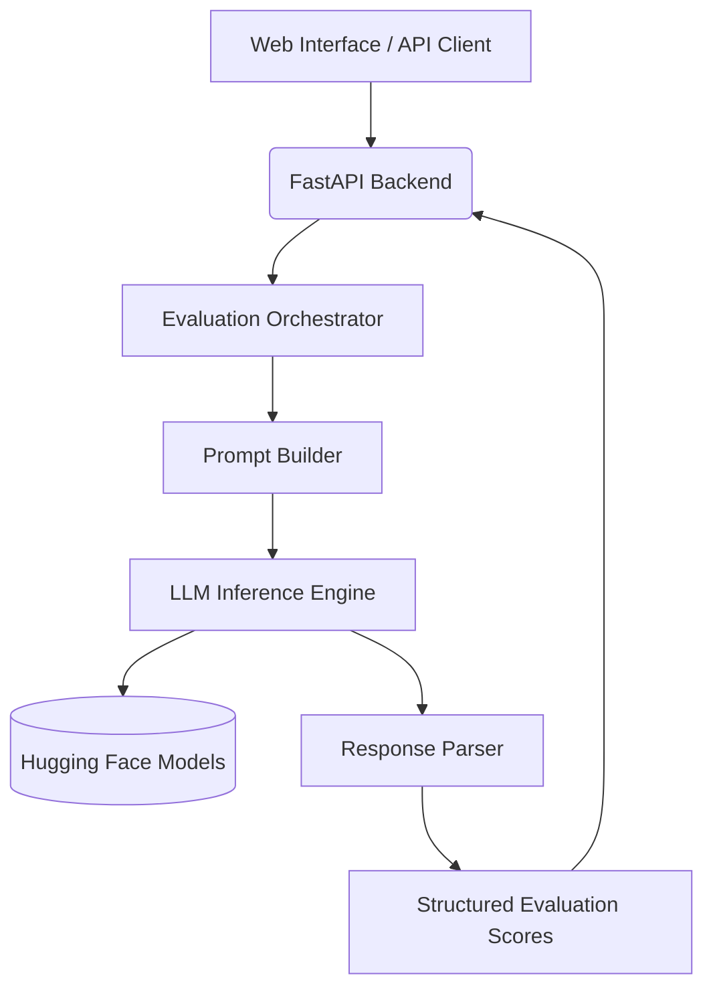

# Conversation Evaluation Benchmark System

A production-ready platform that evaluates AI conversations across hundreds of quality, safety, reasoning, and behavioral dimensions. The system leverages open-source Large Language Models (LLMs) to generate detailed evaluation scores and presents the results through an interactive dashboard.


---

## Project Overview

This project was built to automate the evaluation of AI-generated conversations. Instead of relying on a few basic metrics, it analyzes responses across more than **390 evaluation facets**, including reasoning ability, empathy, logical consistency, safety, fairness, helpfulness, and conversational quality.

The platform is designed with scalability in mind, making it suitable for benchmarking different LLMs, testing prompt performance, and monitoring AI system quality.

---

## Key Features

* Evaluate conversations across **391 different quality dimensions**
* Generate semantic scores using **Hugging Face open-source language models**
* Support popular models such as **Qwen, Llama, and Mixtral**
* Interactive dashboard with:

  * Overall evaluation score
  * Category-wise score breakdown
  * Radar chart visualization
  * JSON export functionality
* High-performance FastAPI backend with asynchronous processing
* Batch evaluation for handling large numbers of scoring facets efficiently
* Docker support for simple deployment and portability

---

## Getting Started

### 1. Install the required packages

```bash
pip install -r requirements.txt
```

### 2. Configure the environment

Rename `.env.example` to `.env` and provide your Hugging Face API token.

```env
LLM_BACKEND=huggingface
HF_API_TOKEN=your_token_here
MODEL_NAME=Qwen/Qwen2.5-7B-Instruct
```

### 3. Launch the application

```bash
uvicorn app.main:app --reload
```

After the server starts, open:

```
http://localhost:8000
```

to access the evaluation dashboard.

---

## System Architecture

The application follows a modular architecture where each component is responsible for a specific stage of the evaluation pipeline.



---

## Project Structure

```
app/
│── api/                 # API endpoints
│── scorer/              # Evaluation engine
│── models/              # Data models
│── services/            # Business logic

data/
│── facets_cleaned.csv   # Evaluation facet definitions

static/
│── HTML, CSS and JavaScript assets

scripts/
│── Utility scripts for preprocessing and batch evaluation

tests/
│── Unit and integration tests
```

---

## Configuration

The application behavior can be customized through the `.env` file.

| Environment Variable | Purpose                                           |
| -------------------- | ------------------------------------------------- |
| `LLM_BACKEND`        | Selects the language model backend                |
| `HF_API_TOKEN`       | Hugging Face API authentication token             |
| `MODEL_NAME`         | Model used for evaluation                         |
| `FACET_BATCH_SIZE`   | Number of evaluation facets processed per request |

---

## Technologies Used

* Python 3.11+
* FastAPI
* Hugging Face Inference API
* AsyncIO
* HTML, CSS and JavaScript
* Docker

---

## Use Cases

This project can be used for:

* Benchmarking Large Language Models
* Prompt engineering and evaluation
* AI quality assurance
* Safety and bias assessment
* Conversation analytics
* Research and experimentation with conversational AI

---

## Future Improvements

* Support for multiple LLM providers
* Historical evaluation tracking
* Authentication and user management
* PDF report generation
* Performance analytics dashboard
* Custom evaluation templates
